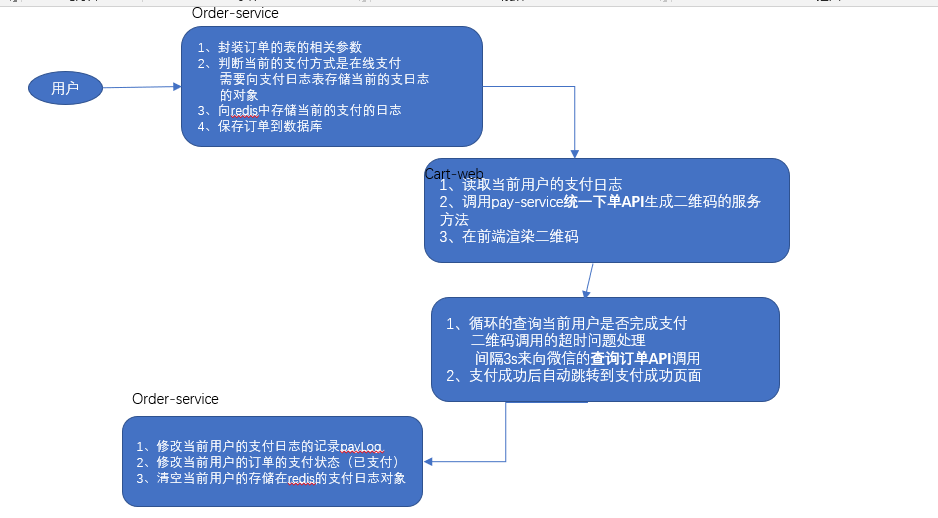

## 1、微信支付

### 1.1、二维码的生成插件

插件：QRious、qrcode.js

1、引入官方提供的js的插件

2、按照官方的Demo案例， 自己手动写一个案例

```js


<script>

 var qr = new QRious({
            element:document.getElementById('aa'),
            size:250,      
   			level:'H',        
   			value:'http://www.itcast.cn'
 });
</script>
```

3、按照自己的项目的需求去更改响应的属性

| 参数         | 类型     | 默认值         | 描述                          |
| ---------- | ------ | ----------- | --------------------------- |
| background | String | "white"     | 二维码的背景颜色。                   |
| foreground | String | "black"     | 二维码的前景颜色。                   |
| **level**  | String | "L"         | **二维码的误差校正级别(L, M, Q, H)。** |
| mime       | String | "image/png" | 二维码输出为图片时的MIME类型。           |
| size       | Number | 100         | 二维码的尺寸，单位像素。                |
| value      | String | ""          | 需要编码为二维码的值                  |

### 1.2、微信支付申请流程

1、流程：官方的 **注册公众号（类型须为：服务号）**， 设置目的是要求有支付的功能

2、一般情况下，微信的公众号不用我们开发人员来申请。

​	**商务**： 就是第三方公司沟通流程。把这个账号发给你。

### 1.3、微信支付流程分析

https://pay.weixin.qq.com/wiki/doc/api/native.php?chapter=6_1

模式一：  我们开发人员不用自己去生成二维码。会自动的跳转到微信支付平台。微信支付的状态都是微信官方去监控，如果支付成功， 微信官方会去调用  **“回调地址”**, 要求回调地址必须是 公网IP。 我们开发阶段是不能使用的。

**模式二**： 开发人员调用微信官方的**统一下单**API接口，接口返回的结果里包含微信支付的二维码的链接

code_url:  **weixin：//wxpay/s/An4baqw**， 我们通过二维码的生成插件来生成二维码。我们还需要调用微信官方的查询订单API，**循环**查询当前的订单的支付状态。如果支付成功实现自己的逻辑。

**注意：code_url有效期为2小时，过期后扫码不能再发起支付。**提示你当前二维码已过期

## 2、支付工程搭建

**统一调用第三方的接口通用方式：**  请求参数、请求方式、返回值（json/xml...）

​	1、封装指定参数（必须或者是非必须）

​	2、发送请求（HttpClient:模拟浏览器发送请求得到结果）、

```java
HttpClient client = new HttpClient(CREATE_NATIVE_PAY_URL);
client.setHttps(true);
client.setXmlParam(xmlParam);
client.post();
// 3.获得结果
String result = client.getContent();
```

​	3、解析结果， 并返回

## 3、调用微信支付查询的支付的时机

前端js循环调用

js(循环)  --->  controller-->service（微信查询订单状态的api）

**后端循环调用（推荐）**

js(生成二维码的时候)--->  controller(循环)  ----> service

```java
try {
  Thread.sleep(3000);// 间隔三秒
} catch (InterruptedException e) {
  e.printStackTrace();
}
```

二维码的超时处理： 重新生成一个新的二维码， 保证用户能够完成支付。如果关闭当前页面，此时就不会在去向后端放松请求

## 4、日志支付记录

思路分析：

（1）在用户下订单时，**判断如果为微信支付**，就想支付日志表添加一条记录，信息包括支付总金额、订单ID（多个）、用户ID 、下单时间等信息，**支付状态为0（未支付）**

（2）生成的支付**日志对象放入redis中**，以**用户ID作为key**，这样在生成支付二维码时就可以从redis中提取支付日志对象中的**金额和订单号**。

（3）当用户支付成功后，修改支付**日志的支付状态为1（已支付）**，并记录微信传递给我们的交易流水号。根据订单ID（多个）修改**订单的状态为2（已付款），清空当前redis用户的支付日志**



## 5、运营商后台

显示当前所有的用户的支付日志。显示支付日志列表，实现按日期、状态、用户进行查询。**学员实现**

报表： 

1、按照商家在某一个季度的报表

2、大数据分析

